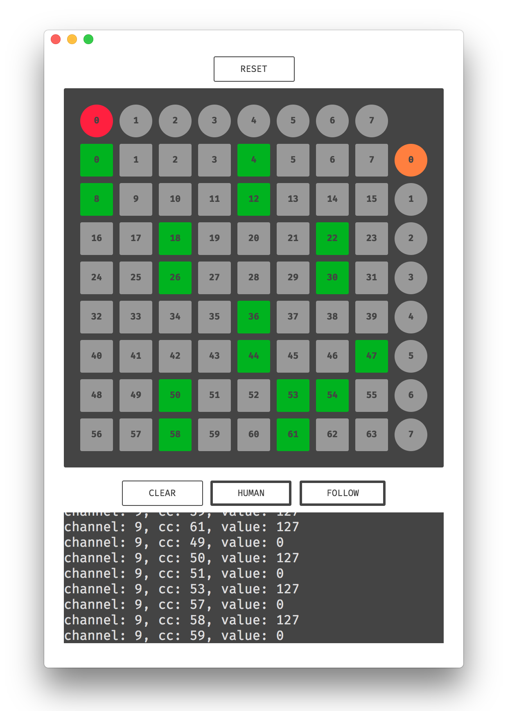

# midi-monitor

A basic MIDI input port monitoring desktop app built with
[Electron](https://github.com/electron/electron) and
[React](https://github.com/facebook/react).



This project is still a WIP - there are no builds available yet, however it is
still usable in development mode:

```sh
git clone https://github.com/lokua/midi-monitor.git
cd midi-monitor
npm i
npm start
```
